# 03 — Architecture

## 1. System Overview

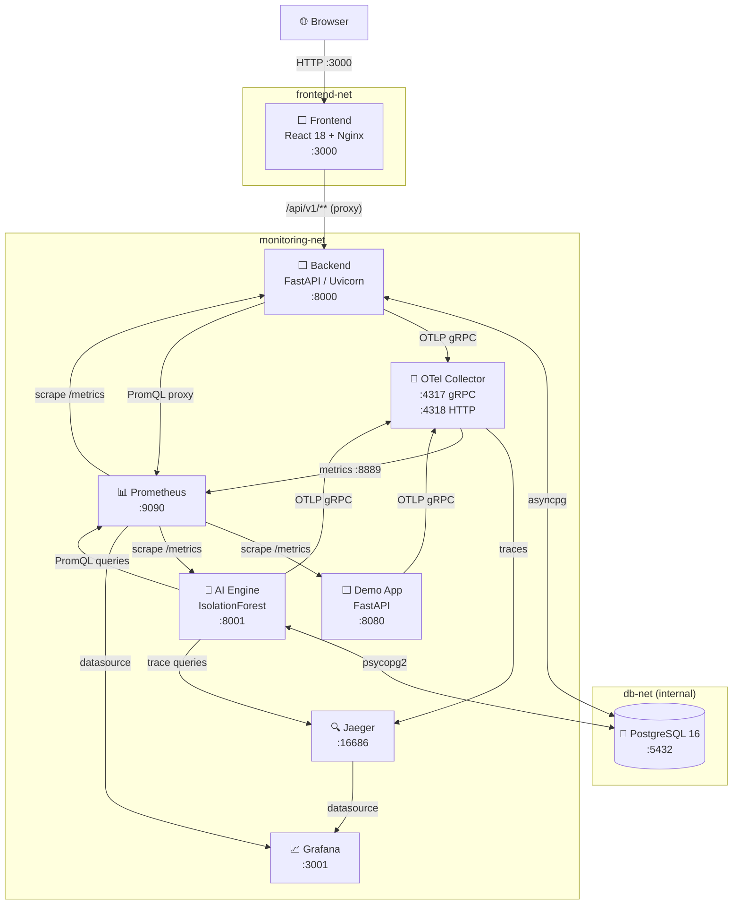

---

## 2. Docker Network Isolation

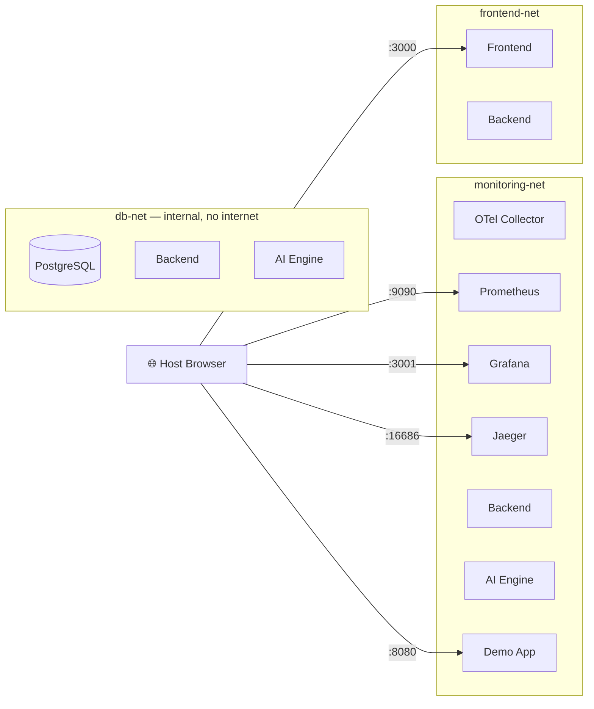

---

## 3. Request Data Flow

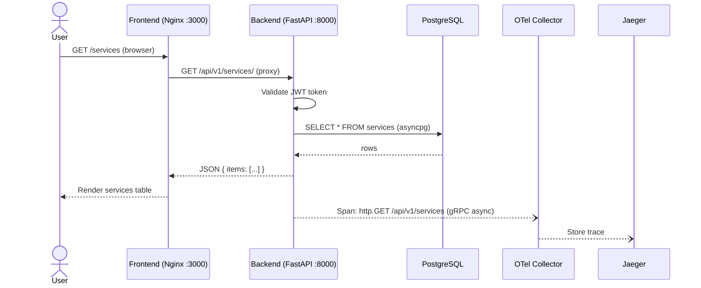

---

## 4. AI Engine Pipeline (every 60 seconds)

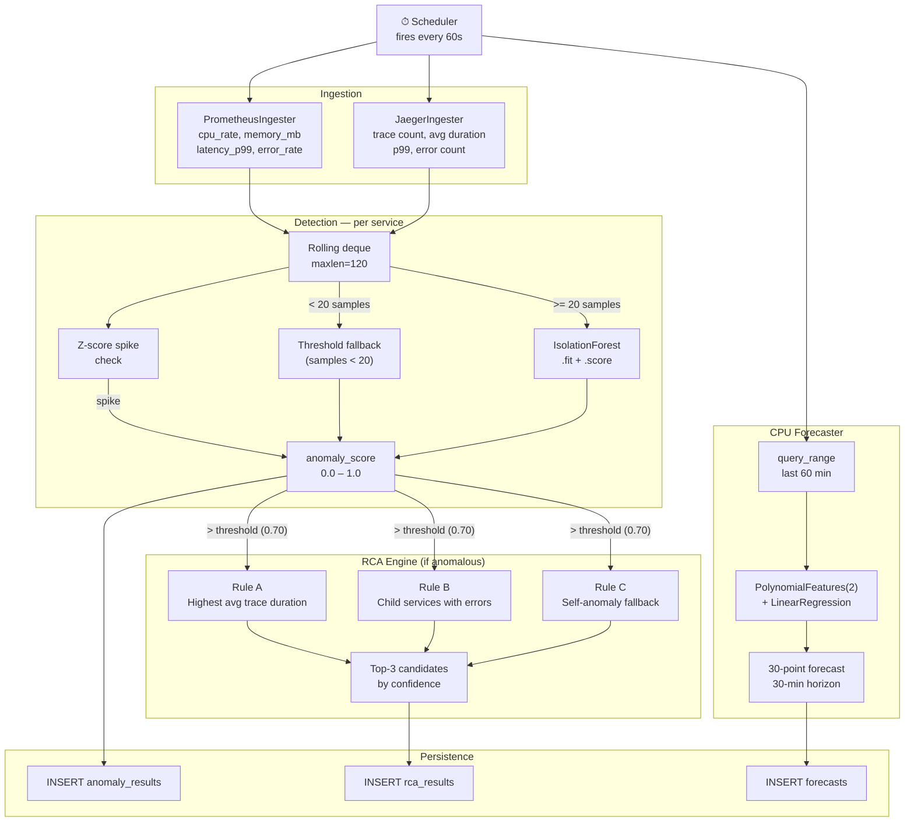

---

## 5. Demo Scenario System

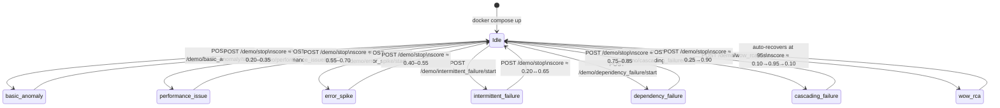

---

## 6. wow_rca — Phase Timeline

```mermaid
gantt
    title wow_rca Scenario — Phase Timeline
    dateFormat  s
    axisFormat  %Ss

    section Payment DB
    Phase 1 — payment_db_degrading (lat 0.6s, err 5%)  : 0, 20s

    section Cascade Begins
    Phase 2 — order_cascade_begins (pay lat 1.8s 40% err, ord lat 1.2s 25% err) : 20, 45s

    section Full Impact
    Phase 3 — full_impact (pay 3.0s 90% err, ord 2.5s 70% err, CPU burn) : 45, 75s

    section Recovery
    Phase 4 — recovering (pay 0.4s 5% err, ord 0.2s 2% err) : 75, 95s

    section Stable
    Phase 5 — recovered (all effects = 0) : 95, 120s
```

---

## 7. Database Entity Relationships

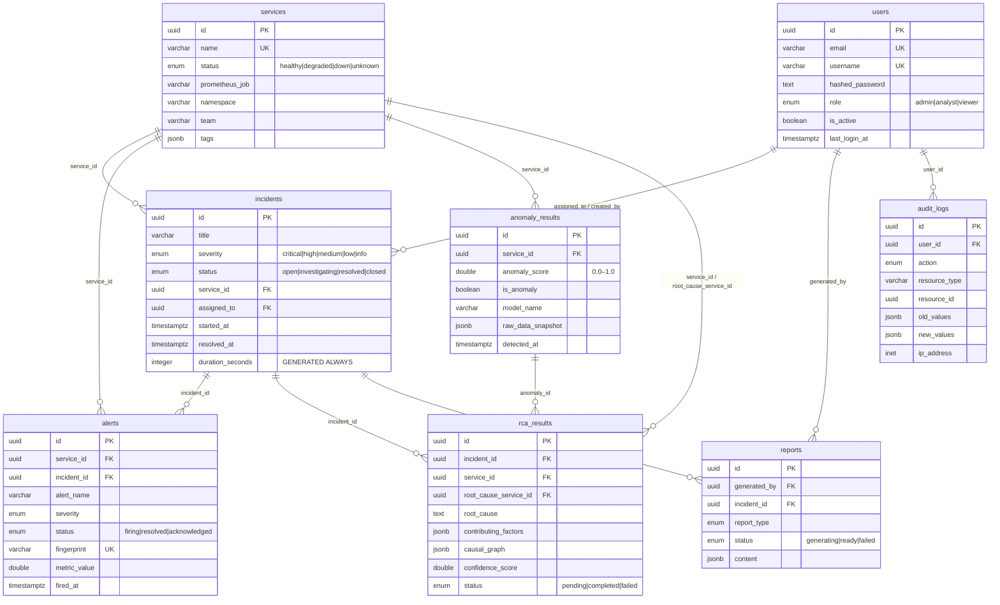

---

## 8. Frontend Page → API Map

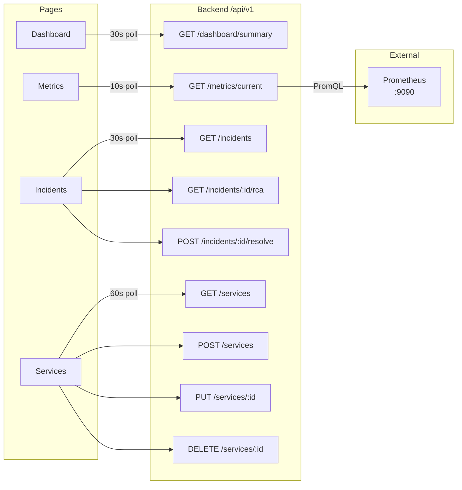

---

## Component Responsibilities

| Component | Owns | Does NOT own |
|---|---|---|
| **Backend** | REST API, auth, business rules, DB reads/writes | Anomaly detection, metric ingestion |
| **AI Engine** | Detection pipeline, RCA, forecasting, persistence | User auth, API serving |
| **Frontend** | UI rendering, polling, user interaction | Business logic, direct DB access |
| **Demo App** | Synthetic traffic, OTel instrumentation, chaos injection | Real business logic |
| **Prometheus** | Metric time-series storage | Alert routing |
| **Jaeger** | Trace storage and query | Metrics |
| **OTel Collector** | Trace/metric reception and fan-out | Processing logic |

---

## Key Design Decisions

**Async backend, sync AI engine:** FastAPI backend uses `asyncpg` (fully async) for high concurrency. The AI engine uses `psycopg2` (sync) inside a background thread — scikit-learn's `fit()` is CPU-bound and releases the GIL, making threading appropriate.

**Schema bootstrapped by schema.sql, tracked by Alembic:** Initial schema created by PostgreSQL's `initdb` mechanism. Alembic migration 0001 is a no-op baseline stamp. All future changes go through `alembic revision --autogenerate`.

**OTel Collector as central fan-out:** All instrumented services send to one endpoint (`otel-collector:4317`). The collector routes to Jaeger and Prometheus without code changes in the services.

**Self-generating demo traffic:** Each scenario coroutine runs `asyncio.gather(traffic_loop, phase_logic)` — the traffic loop fires HTTP requests against its own endpoints so Prometheus always has real samples to scrape, regardless of external load.

---

## 9. Sequence Diagrams (Biểu đồ tuần tự)

### 9a. User Login & Token Lifecycle

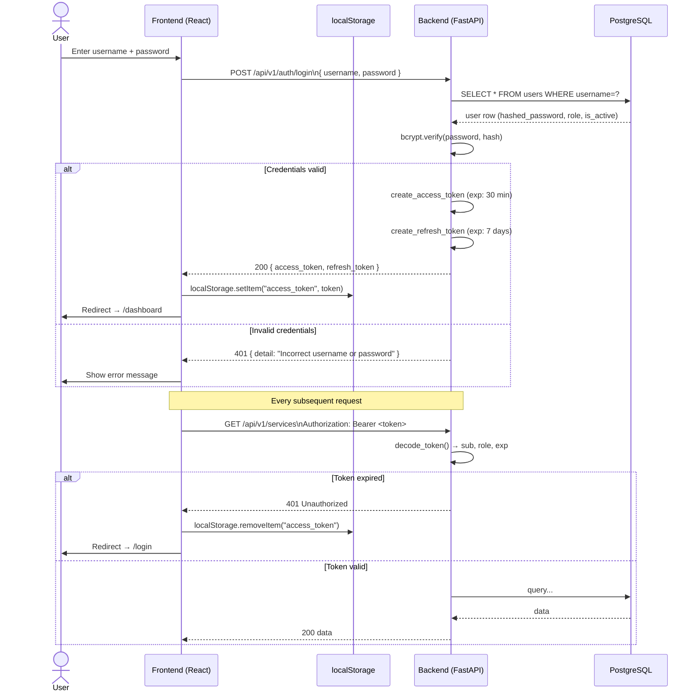

---

### 9b. Anomaly Detected → RCA → Dashboard Update

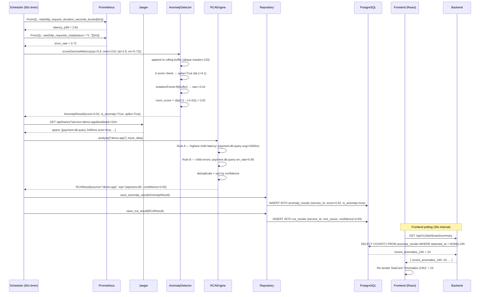

---

### 9c. Demo Scenario Start → Metrics Change → Detection

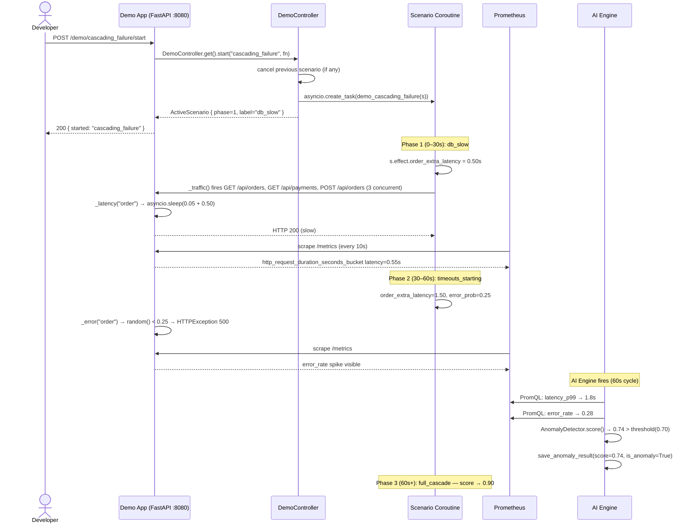

---

## 10. Class Diagram (Biểu đồ lớp)

### 10a. Backend — ORM Models & Relations

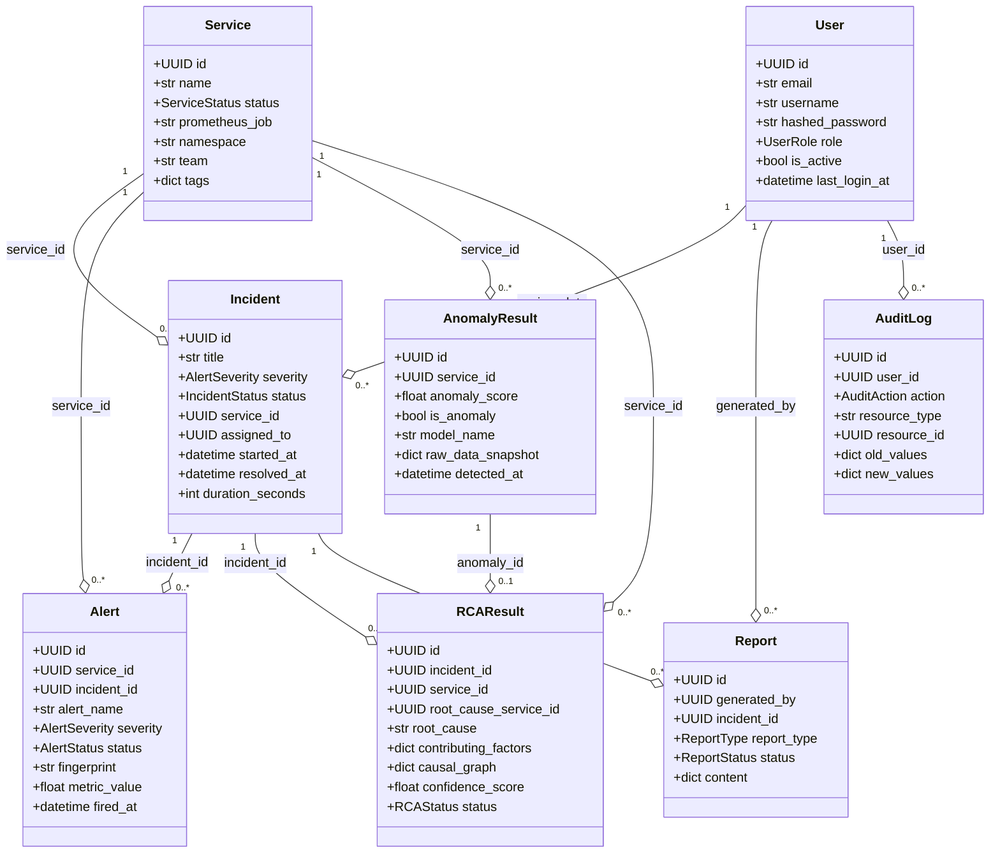

---

### 10b. AI Engine — Detection & RCA Classes

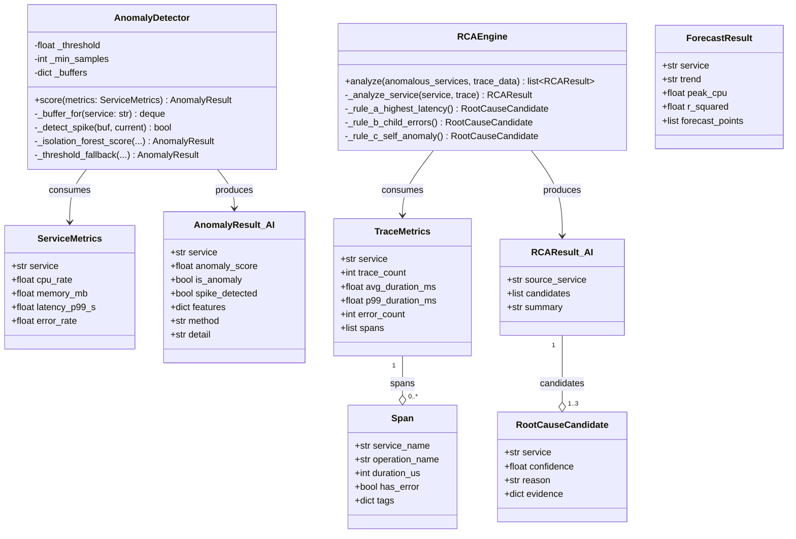

---

### 10c. Demo App — Scenario Controller

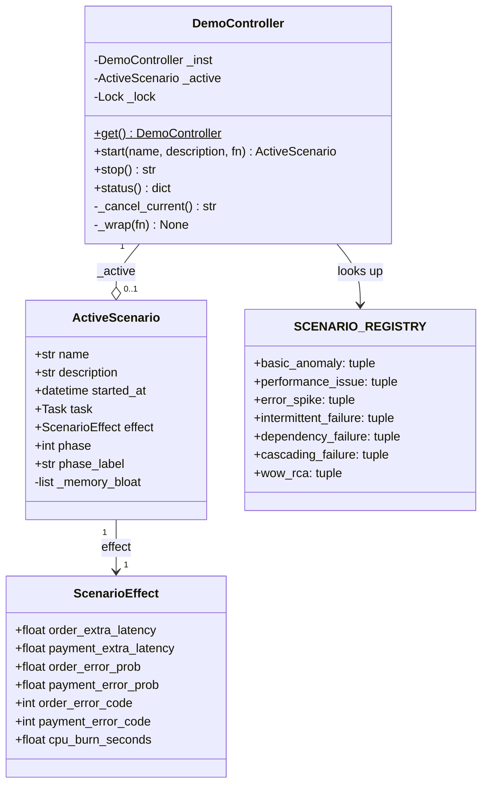

---

## 11. Use Case Diagram (Biểu đồ ca sử dụng)

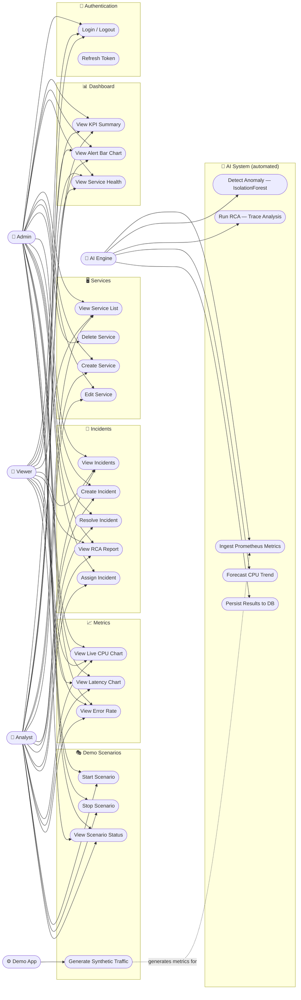
