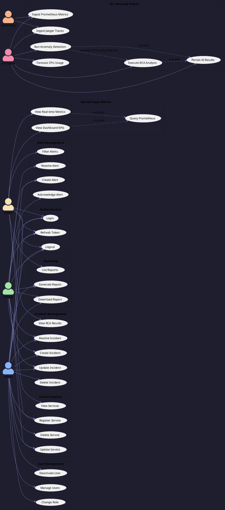
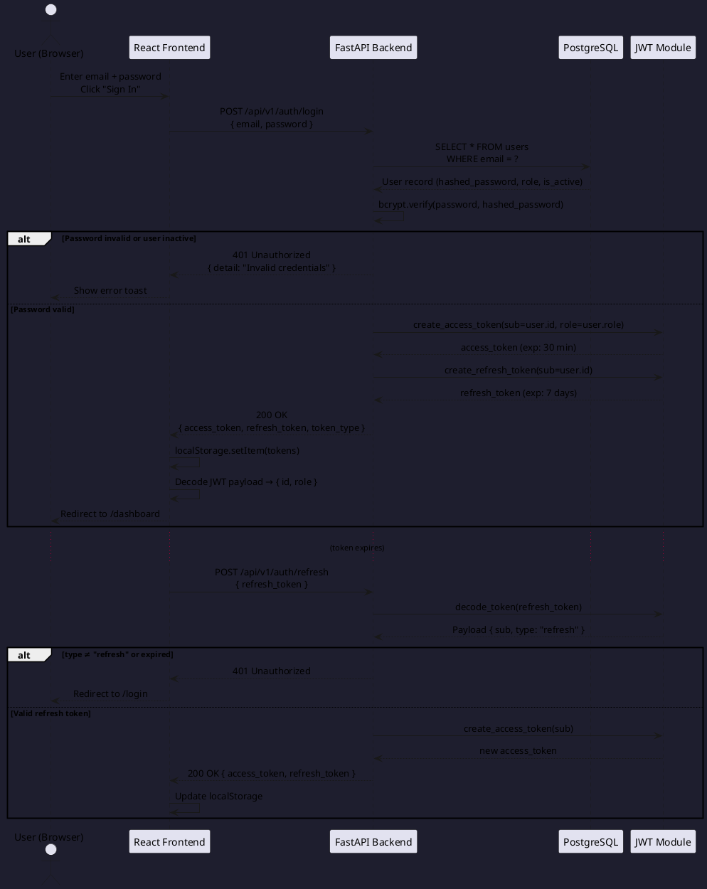
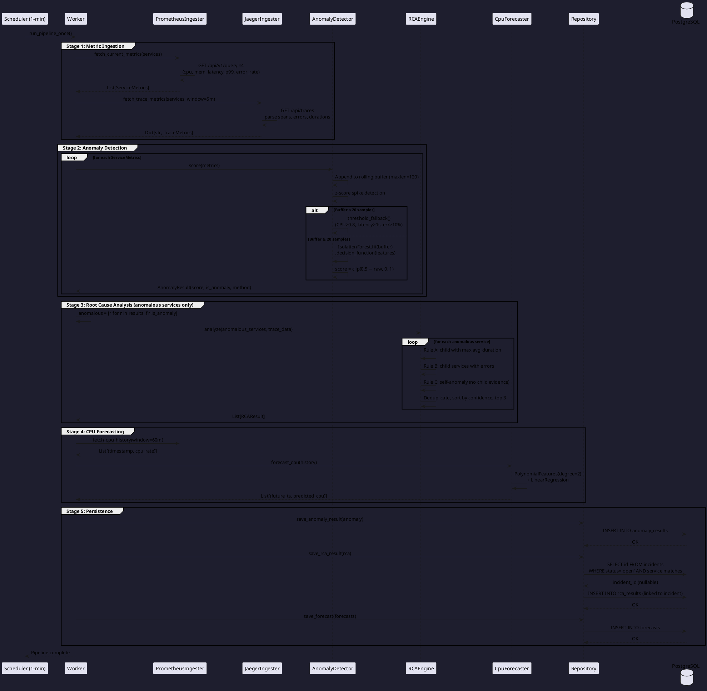
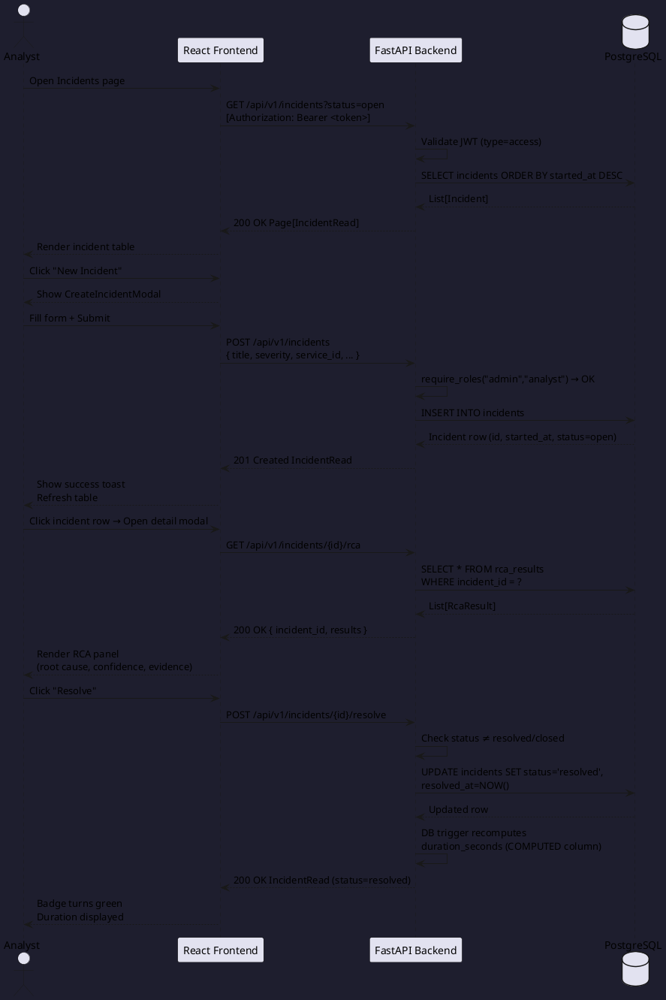
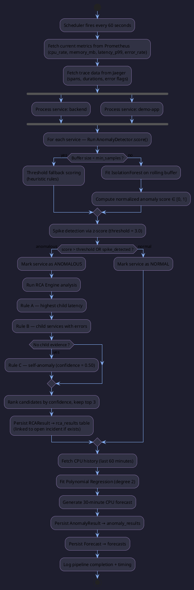
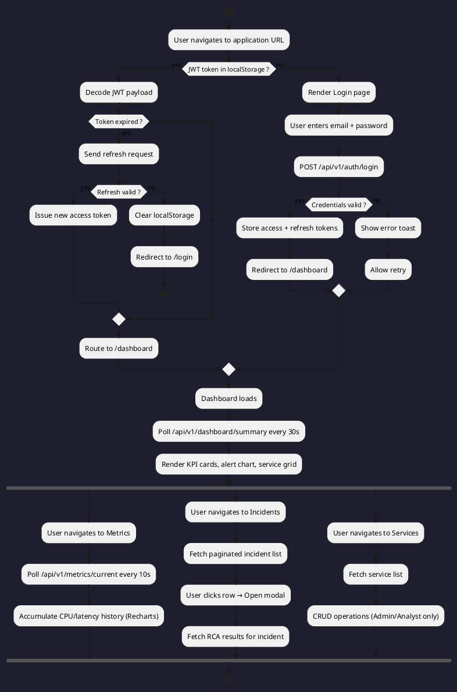
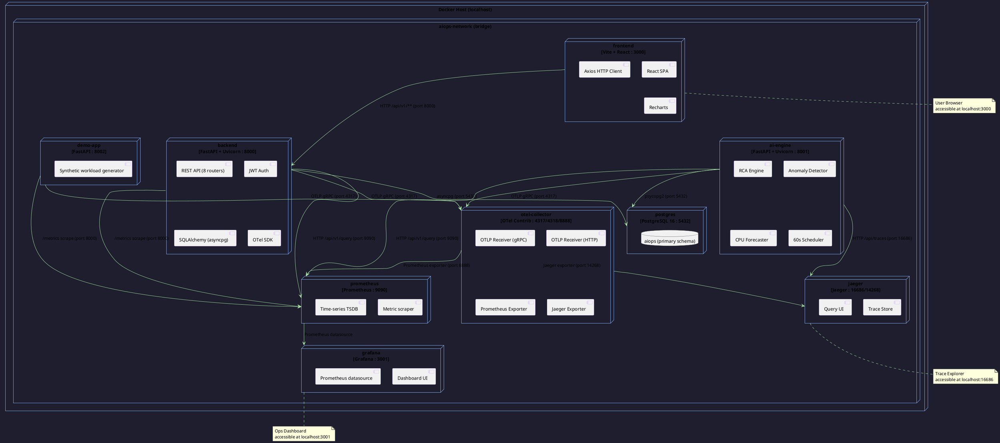
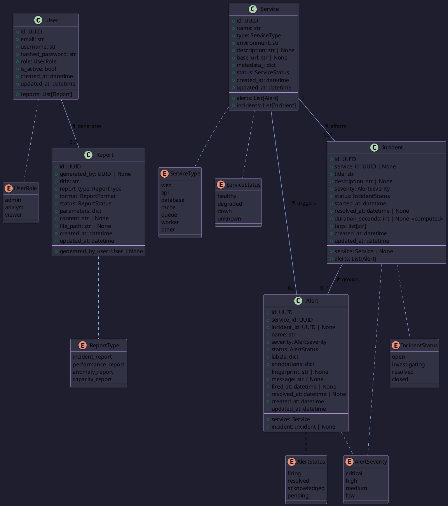
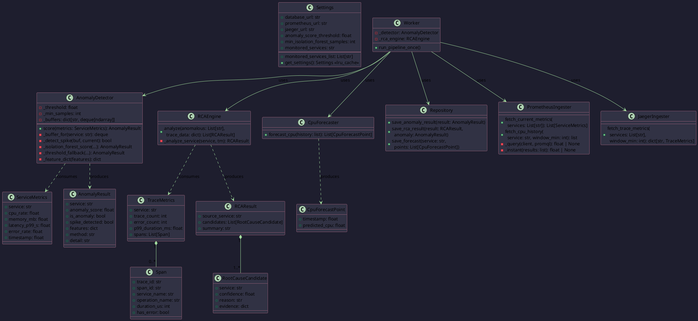

# AIOps – AI-based Software Performance Analysis System
## Graduation Thesis: System Design Artifacts

**Institution:** University of Information Technology  
**Project Title:** AIOps – AI-based Software Performance Analysis System  
**Academic Year:** 2025–2026  

---

## Table of Contents

1. [Use Case Diagram](#1-use-case-diagram)
2. [Sequence Diagrams](#2-sequence-diagrams)
3. [Activity Diagram](#3-activity-diagram)
4. [Deployment Diagram](#4-deployment-diagram)
5. [Class Diagram](#5-class-diagram)
6. [Functional Requirements](#6-functional-requirements)
7. [Non-Functional Requirements](#7-non-functional-requirements)
8. [Risk Analysis](#8-risk-analysis)
9. [Testing Strategy](#9-testing-strategy)

---

## 1. Use Case Diagram

### 1.1 Actor Definitions

| Actor | Description |
|---|---|
| **Admin** | Full system access: user management, all CRUD operations, delete incidents |
| **Analyst** | Operational role: create/update incidents and alerts, generate reports, view all data |
| **Viewer** | Read-only: view dashboard, incidents, metrics, services |
| **AI Engine** | Automated system actor: ingests metrics, runs detection, persists anomaly/RCA results |
| **Demo App** | Instrumented microservice that emits OpenTelemetry traces and Prometheus metrics |

### 1.2 PlantUML Source



### 1.3 Use Case Summary Table

| ID | Use Case | Primary Actor | Priority |
|---|---|---|---|
| UC01 | Login with credentials | All Users | High |
| UC02 | Refresh JWT token | All Users | High |
| UC04 | Manage Users (CRUD) | Admin | High |
| UC07 | Register Service | Admin, Analyst | High |
| UC11 | View Real-time Metrics | All Users | High |
| UC12 | View Dashboard KPIs | All Users | High |
| UC14 | Create Alert | Admin, Analyst | High |
| UC18 | Create Incident | Admin, Analyst | High |
| UC20 | Resolve Incident | Admin, Analyst | High |
| UC22 | View RCA Results | All Users | High |
| UC23 | Ingest Prometheus Metrics | AI Engine | High |
| UC25 | Run Anomaly Detection | AI Engine | High |
| UC26 | Execute RCA Analysis | AI Engine | High |
| UC27 | Forecast CPU Usage | AI Engine | Medium |
| UC29 | Generate Report | Admin, Analyst | Medium |

---

## 2. Sequence Diagrams

### 2.1 User Authentication Flow



---

### 2.2 Anomaly Detection and RCA Pipeline (AI Engine)



---

### 2.3 Incident Lifecycle: Create → View RCA → Resolve



---

## 3. Activity Diagram

### 3.1 AI Engine One-Minute Pipeline



### 3.2 User Login and Dashboard Access



---

## 4. Deployment Diagram

### 4.1 Docker Compose Infrastructure



### 4.2 Port Reference

| Container | Service | Exposed Port | Protocol |
|---|---|---|---|
| frontend | React SPA | 3000 | HTTP |
| backend | FastAPI REST API | 8000 | HTTP |
| ai-engine | FastAPI + Scheduler | 8001 | HTTP |
| demo-app | Synthetic workload | 8002 | HTTP |
| postgres | PostgreSQL 16 | 5432 | TCP |
| prometheus | Metrics TSDB | 9090 | HTTP |
| grafana | Visualization | 3001 | HTTP |
| otel-collector | OTLP gRPC receiver | 4317 | gRPC |
| otel-collector | OTLP HTTP receiver | 4318 | HTTP |
| otel-collector | Internal metrics | 8888 | HTTP |
| jaeger | Query UI | 16686 | HTTP |
| jaeger | Thrift/HTTP collector | 14268 | HTTP |

---

## 5. Class Diagram

### 5.1 Domain Model (Backend)



### 5.2 AI Engine Class Diagram



---

## 6. Functional Requirements

### 6.1 Authentication and Authorization

| ID | Requirement | Priority | Acceptance Criteria |
|---|---|---|---|
| FR-AUTH-01 | The system shall authenticate users via email/password and return JWT access token (30 min) and refresh token (7 days). | High | POST /auth/login returns tokens; invalid credentials return 401 |
| FR-AUTH-02 | The system shall enforce role-based access control with three roles: admin, analyst, viewer. | High | Endpoints restricted by role return 403 when unauthorized role accesses |
| FR-AUTH-03 | The system shall allow token refresh without re-authentication when the refresh token is valid. | High | POST /auth/refresh returns new access token; expired refresh returns 401 |
| FR-AUTH-04 | The system shall hash passwords using bcrypt before persisting to the database. | High | Plaintext passwords never stored; bcrypt hash verified on login |
| FR-AUTH-05 | Admin users shall be able to create, update, deactivate, and change roles of other users. | High | CRUD operations on /users restricted to admin role |

### 6.2 Service Registry

| ID | Requirement | Priority | Acceptance Criteria |
|---|---|---|---|
| FR-SVC-01 | The system shall maintain a registry of monitored services with name, type, environment, status, and metadata. | High | GET /services returns paginated list with all fields |
| FR-SVC-02 | Administrators and analysts shall be able to register new services with a unique name. | High | POST /services; duplicate name returns 409 Conflict |
| FR-SVC-03 | Service status shall reflect one of: healthy, degraded, down, unknown. | High | Status field constrained by DB enum; invalid values rejected |
| FR-SVC-04 | Service deletion shall cascade to remove associated alerts. | Medium | DELETE /services/{id}; associated alerts removed automatically |

### 6.3 Monitoring and Metrics

| ID | Requirement | Priority | Acceptance Criteria |
|---|---|---|---|
| FR-MET-01 | The system shall expose real-time per-service metrics (CPU, memory, latency p99, error rate) by proxying Prometheus queries. | High | GET /metrics/current returns current values within 10 seconds of poll |
| FR-MET-02 | The dashboard shall provide aggregate KPIs: total services, active alerts by severity, open incidents, MTTR, anomaly count. | High | GET /dashboard/summary returns all KPI fields with correct aggregation |
| FR-MET-03 | The frontend shall poll metrics every 10 seconds and maintain a rolling 50-point history for charting. | High | Charts update on each poll; no memory leak; stale-closure-safe via useRef |
| FR-MET-04 | The system shall expose Prometheus scrape endpoint on /metrics for backend and demo-app instrumentation. | Medium | Prometheus targets show UP status for all instrumented services |

### 6.4 Alert Management

| ID | Requirement | Priority | Acceptance Criteria |
|---|---|---|---|
| FR-ALR-01 | The system shall manage alerts with severity (critical/high/medium/low) and status (firing/acknowledged/resolved/pending). | High | Full lifecycle state transitions enforced |
| FR-ALR-02 | Alerts shall be associated with a service and optionally linked to an incident. | High | Foreign key constraints enforced; orphaned alert status preserved on service deletion |
| FR-ALR-03 | When a critical-severity alert fires, the system shall log a CRITICAL-level server event asynchronously. | Medium | Log entry present within 1 second of alert creation; does not block API response |
| FR-ALR-04 | Alerts shall support filtering by severity, status, and service_id via query parameters. | High | Query params applied correctly; pagination respected |

### 6.5 Incident Management

| ID | Requirement | Priority | Acceptance Criteria |
|---|---|---|---|
| FR-INC-01 | The system shall support full incident lifecycle: open → investigating → resolved → closed. | High | State transitions via PATCH and POST /resolve; invalid transitions rejected with 409 |
| FR-INC-02 | Incident duration shall be automatically computed as a PostgreSQL GENERATED ALWAYS column from (resolved_at − started_at). | High | duration_seconds populated automatically upon resolution; NULL for open incidents |
| FR-INC-03 | The system shall expose RCA results linked to an incident via GET /incidents/{id}/rca. | High | Returns up to 10 most recent RCA results ordered by created_at DESC |
| FR-INC-04 | Only admin and analyst roles shall create, update, or resolve incidents. | High | 403 returned for viewer role on mutating endpoints |
| FR-INC-05 | Only admin role shall delete incidents. | High | 403 returned for analyst and viewer on DELETE |

### 6.6 AI Engine — Anomaly Detection

| ID | Requirement | Priority | Acceptance Criteria |
|---|---|---|---|
| FR-AI-01 | The AI engine shall ingest Prometheus metrics for all configured services every 60 seconds. | High | Scheduler fires at ±2s precision; metrics fetched via HTTP |
| FR-AI-02 | The system shall detect anomalies using Isolation Forest trained on a rolling 120-sample buffer per service. | High | Anomaly score produced in [0,1] range; method field = "isolation_forest" |
| FR-AI-03 | During the warm-up period (< 20 samples), the system shall fall back to heuristic threshold scoring. | High | method field = "threshold_fallback"; no exception thrown during warm-up |
| FR-AI-04 | Spike detection using z-score (threshold = 3.0) shall operate independently of Isolation Forest and override anomaly=false. | High | spike_detected=true forces is_anomaly=true regardless of score |
| FR-AI-05 | The AI engine shall run Root Cause Analysis only on services flagged as anomalous. | High | RCA not called for normal services; rca_results row only inserted for anomalous ones |
| FR-AI-06 | RCA candidates shall be ranked by confidence score and limited to top 3 per anomalous service. | High | Candidates list length ≤ 3; sorted descending by confidence |

### 6.7 AI Engine — Forecasting

| ID | Requirement | Priority | Acceptance Criteria |
|---|---|---|---|
| FR-FC-01 | The system shall forecast CPU usage for the next 30 minutes using polynomial regression (degree 2) on the last 60 minutes of history. | Medium | 30 forecast points generated per service; each has timestamp and predicted_cpu |
| FR-FC-02 | Forecasts shall be persisted to the forecasts table after each pipeline run. | Medium | Rows inserted; queryable for Grafana dashboards |

### 6.8 Reporting

| ID | Requirement | Priority | Acceptance Criteria |
|---|---|---|---|
| FR-RPT-01 | The system shall support report types: incident_report, performance_report, anomaly_report, capacity_report. | Medium | report_type enum enforced; invalid type returns 422 |
| FR-RPT-02 | Reports shall track generation status: pending → generating → ready/failed. | Medium | Status transitions persisted; ready reports expose content or file_path |
| FR-RPT-03 | Report generation shall be restricted to admin and analyst roles. | Medium | 403 for viewer on POST /reports |

---

## 7. Non-Functional Requirements

### 7.1 Performance

| ID | Requirement | Metric | Verification |
|---|---|---|---|
| NFR-PERF-01 | REST API endpoints shall respond within 500ms at p99 under normal load (≤ 50 concurrent users). | p99 latency < 500ms | Load test with Locust; 50 concurrent users, 5-minute soak |
| NFR-PERF-02 | Dashboard summary endpoint shall respond within 200ms (cached aggregation). | p95 < 200ms | Prometheus metric `http_request_duration_seconds` histogram |
| NFR-PERF-03 | AI engine pipeline shall complete within 30 seconds per cycle (well within the 60-second interval). | Pipeline duration < 30s | Worker timer log on each run |
| NFR-PERF-04 | The frontend shall achieve Time-to-Interactive (TTI) under 3 seconds on a standard broadband connection. | TTI < 3s | Lighthouse audit in production build mode |
| NFR-PERF-05 | Isolation Forest training shall complete within 2 seconds per service per pipeline cycle. | IsolationForest.fit < 2s | Timing instrumentation; 120 samples × 4 features |

### 7.2 Security

| ID | Requirement | Verification |
|---|---|---|
| NFR-SEC-01 | All API endpoints (except /auth/login and /health) shall require a valid JWT access token. | Automated test: unauthenticated request returns 401 |
| NFR-SEC-02 | JWT tokens shall use HS256 algorithm with a minimum 32-character secret key. | Code review: secret_key length validation at startup |
| NFR-SEC-03 | Passwords shall be hashed with bcrypt using a cost factor ≥ 12. | Security review: passlib CryptContext configuration |
| NFR-SEC-04 | The system shall not expose stack traces or internal errors in API responses in production. | Integration test: 500 errors return generic message only |
| NFR-SEC-05 | CORS shall be restricted to configured origins only. | Browser test: cross-origin requests from unlisted origins blocked |
| NFR-SEC-06 | Database credentials and JWT secrets shall be stored in environment variables, never in source code. | Code scan: no hardcoded secrets in committed files |
| NFR-SEC-07 | SQL injection shall be prevented by using parameterized queries (SQLAlchemy ORM exclusively). | Static analysis: no raw f-string SQL construction |

### 7.3 Reliability and Availability

| ID | Requirement | Metric |
|---|---|---|
| NFR-REL-01 | The system shall be available ≥ 99% uptime in the local deployment environment (Docker Compose restart policies). | `restart: unless-stopped` on all containers |
| NFR-REL-02 | The AI engine shall retry failed Prometheus and Jaeger HTTP requests up to 3 times with exponential backoff (tenacity). | Retry logic verified; pipeline continues on partial failure |
| NFR-REL-03 | The database connection pool shall recover from transient failures with up to 10 retry attempts at startup. | `init_db()` with @retry(stop_after_attempt(10)) |
| NFR-REL-04 | A failed AI pipeline cycle shall not crash the scheduler; the next cycle shall proceed normally. | Worker exception handling: try/except logs error and continues |

### 7.4 Maintainability

| ID | Requirement |
|---|---|
| NFR-MNT-01 | The codebase shall follow a clean, layered architecture: routers → schemas → models → database, with no circular imports. |
| NFR-MNT-02 | Database schema changes shall be managed exclusively through Alembic migrations; direct DDL modification is prohibited. |
| NFR-MNT-03 | All async SQLAlchemy models shall use SQLAlchemy 2.0 `Mapped` annotation style. |
| NFR-MNT-04 | Frontend components shall be stateless where possible; side effects isolated to hooks and context providers. |
| NFR-MNT-05 | All Docker services shall be configurable via environment variables without code changes. |

### 7.5 Observability

| ID | Requirement |
|---|---|
| NFR-OBS-01 | All three instrumented services (backend, ai-engine, demo-app) shall export OpenTelemetry traces to the OTel Collector via OTLP gRPC (port 4317). |
| NFR-OBS-02 | The backend and demo-app shall export Prometheus metrics on /metrics for scraping every 15 seconds. |
| NFR-OBS-03 | All containers shall emit structured JSON logs to stdout for Docker log collection. |
| NFR-OBS-04 | Distributed traces shall be viewable in Jaeger UI at localhost:16686 within 5 seconds of the HTTP request completing. |

### 7.6 Scalability

| ID | Requirement |
|---|---|
| NFR-SCA-01 | The AI engine shall support adding new monitored services by updating the `MONITORED_SERVICES` environment variable without code changes. |
| NFR-SCA-02 | The backend API shall be horizontally scalable (stateless design; no in-memory session state). |
| NFR-SCA-03 | The PostgreSQL schema shall use UUID primary keys and indexed foreign keys to support future data volume growth. |

---

## 8. Risk Analysis

### 8.1 Risk Register

| Risk ID | Risk Description | Category | Probability | Impact | Risk Score | Mitigation Strategy | Contingency |
|---|---|---|---|---|---|---|---|
| R-01 | Prometheus or Jaeger unavailable during AI pipeline cycle | Technical | Medium | High | **High** | Tenacity retry (3× with backoff); pipeline logs warning and continues with partial data | Pipeline skips unavailable source; anomaly detection proceeds with last known metrics |
| R-02 | Isolation Forest warm-up period produces inaccurate anomaly scores | ML/Accuracy | High | Medium | **High** | Threshold fallback active until 20 samples collected; warm-up state exposed in `method` field | Operators notified via `detail` field; false positive rate accepted during initial deployment window |
| R-03 | JWT secret key left as default "change-me-in-production" in deployment | Security | Medium | Critical | **Critical** | Secret key validation at startup; documentation requires .env override | Deployment blocked if default key detected in production environment check |
| R-04 | PostgreSQL connection pool exhaustion under concurrent load | Performance | Low | High | **Medium** | Async connection pooling with `async_sessionmaker`; pool_size configurable via env | Increase pool_size; add read replica for reporting queries |
| R-05 | OTel Collector scratch image has no healthcheck capability | Infrastructure | Confirmed | Low | **Low** | `condition: service_started` dependency; `restart: unless-stopped` | Collector restarts automatically; dependent services retry connections |
| R-06 | Polynomial regression CPU forecast diverges for non-stationary workloads | ML/Accuracy | Medium | Low | **Low** | Degree-2 polynomial limits extrapolation; 30-minute horizon minimizes drift | Expose confidence interval; label as "indicative only" in UI |
| R-07 | React state accumulation memory leak from polling intervals | Frontend | Low | Medium | **Medium** | `useRef` for history buffers; `clearInterval` in useEffect cleanup; bounded history (50 points) | Chrome DevTools heap snapshot in testing phase |
| R-08 | Alembic migration conflicts during parallel schema development | Development | Medium | Medium | **Medium** | Single-developer migration branch policy; sequential migration numbering | `alembic merge heads` to reconcile divergent migration histories |
| R-09 | bcrypt hash comparison timing attack | Security | Low | Medium | **Low** | `passlib.verify` uses constant-time comparison; no early exit | Already mitigated by passlib design |
| R-10 | Demo-app synthetic workload insufficient to trigger anomaly detection | Validation | Medium | High | **High** | Demo-app generates configurable error spikes and latency injection | Add chaos endpoint to manually force anomaly conditions during demo/defense |

### 8.2 Risk Matrix

```
           Impact
           Low        Medium     High       Critical
         ┌──────────┬──────────┬──────────┬──────────┐
High     │          │  R-02    │  R-01    │          │
Prob.    │          │          │          │          │
         ├──────────┼──────────┼──────────┼──────────┤
Medium   │  R-06    │  R-08    │          │  R-03    │
         │          │          │          │          │
         ├──────────┼──────────┼──────────┼──────────┤
Low      │  R-09    │  R-07    │  R-04    │          │
         │  R-05    │          │          │          │
         └──────────┴──────────┴──────────┴──────────┘
                                            R-10 (Medium/High)
```

---

## 9. Testing Strategy

### 9.1 Testing Pyramid Overview

```
                    ┌─────────────────┐
                    │   E2E Tests     │  ← Playwright / manual
                    │   (5–10%)       │
                   /└─────────────────┘\
                  /  ┌───────────────┐  \
                 /   │ Integration   │   \
                /    │  Tests (25%)  │    \
               /     └───────────────┘     \
              /    ┌─────────────────────┐   \
             /     │   Unit Tests (70%)  │    \
            /      └─────────────────────┘     \
```

### 9.2 Unit Testing

| Component | Test Scope | Tool | Key Scenarios |
|---|---|---|---|
| `AnomalyDetector` | `score()` method with synthetic feature vectors | pytest + numpy | (1) Warm-up threshold fallback < 20 samples; (2) Spike detected when z > 3.0; (3) IsolationForest scores known-anomalous vectors > threshold; (4) NaN/zero metrics handled gracefully |
| `RCAEngine` | `analyze()` with synthetic TraceMetrics | pytest | (1) Rule A fires for single high-latency child; (2) Rule B fires for child with errors; (3) Rule C (self-anomaly) when no child spans; (4) Deduplication keeps highest confidence; (5) Top 3 limit enforced |
| `CpuForecaster` | `forecast_cpu()` with synthetic history | pytest + sklearn | (1) Returns 30 points; (2) Predictions within plausible range; (3) Handles minimum 2-sample history |
| `security.py` | `hash_password`, `verify_password`, `create_access_token`, `decode_token` | pytest | (1) Hash is bcrypt format; (2) Verify correct password → True; wrong → False; (3) Token contains sub, type, exp; (4) Expired token raises exception |
| `deps.py` | `get_current_user`, `require_roles` | pytest + httpx | (1) Valid token → User object; (2) Access token type check; (3) Role mismatch → 403; (4) Expired token → 401 |
| `Badge.jsx` | Status badge variants | Vitest + React Testing Library | All 12+ status values render correct color classes |

### 9.3 Integration Testing

| Test Suite | Coverage | Tool | Setup |
|---|---|---|---|
| **Auth flow** | Login → token → refresh → 401 on expiry | pytest + httpx AsyncClient | In-memory SQLite or test PostgreSQL schema |
| **Incident CRUD** | Create → update → resolve; duration_seconds computed | pytest + httpx | Real PostgreSQL via Docker service in CI |
| **Alert filtering** | Query params `?severity=critical&status=firing` returns correct subset | pytest + httpx | Pre-seeded test data fixtures |
| **RCA endpoint** | `GET /incidents/{id}/rca` returns linked rca_results rows | pytest + httpx | AI engine persistence tested independently; mock rows inserted |
| **RBAC enforcement** | Each role tested against each restricted endpoint | pytest parametrize | JWT tokens with each role created via security.py |
| **Pagination** | `skip` and `limit` query params; `total` count correct | pytest + httpx | Fixture with 25 rows; test pages 1, 2, 3 |
| **Prometheus proxy** | `/metrics/current` returns expected structure | pytest + httpx | Mock httpx transport for Prometheus responses |

### 9.4 System / End-to-End Testing

| Scenario | Steps | Pass Criteria |
|---|---|---|
| **Full login flow** | Open `localhost:3000` → enter credentials → land on dashboard | Dashboard KPIs visible; no console errors |
| **Live metrics polling** | Open Metrics page → wait 30s | Chart updates ≥ 2 times; CPU and latency lines render correctly |
| **Incident creation and resolution** | Create incident as analyst → view RCA → resolve | Incident appears in table; status badge changes to "resolved"; duration_seconds populated |
| **RBAC UI enforcement** | Login as viewer → navigate to Services → try create | Create button absent; API returns 403 if called directly |
| **AI pipeline end-to-end** | Start demo-app with high error rate → wait 2 minutes | Anomaly result persisted in DB; RCA result linked to open incident |
| **OTel trace visibility** | Make 10 API calls → open Jaeger UI | All 10 traces visible; spans include database and HTTP child spans |

### 9.5 Performance Testing

| Test | Tool | Target | Method |
|---|---|---|---|
| API throughput under load | Locust | 50 concurrent users; p99 < 500ms | 5-minute soak on `/api/v1/dashboard/summary` |
| Frontend bundle size | Vite build + rollup-plugin-visualizer | < 500KB gzipped main bundle | `npm run build` output analysis |
| DB query performance | EXPLAIN ANALYZE | All paginated queries use index scan | Manual review of slow query log |
| AI pipeline timing | Python `time.perf_counter()` | Full pipeline < 30s | Logged on each run; averaged over 10 cycles |

### 9.6 Test Data Strategy

| Fixture | Description |
|---|---|
| `admin_user` | Seeded admin with known password; used across all auth tests |
| `analyst_user` | Seeded analyst; tests RBAC boundary |
| `viewer_user` | Seeded viewer; tests read-only enforcement |
| `active_service` | Service with status=healthy; parent for alerts and incidents |
| `open_incident` | Linked to active_service; used in RCA and resolve tests |
| `anomaly_metrics` | ServiceMetrics with cpu_rate=0.95, error_rate=0.20; known to trigger threshold fallback as anomalous |

### 9.7 CI / Quality Gates

| Gate | Tool | Threshold |
|---|---|---|
| Unit tests | pytest | 100% pass; 0 failures |
| Code coverage | pytest-cov | ≥ 80% line coverage on `app/` modules |
| Static type checking | mypy (backend) | 0 errors on `app/core`, `app/models`, `app/schemas` |
| Linting | ruff (backend), ESLint (frontend) | 0 errors; warnings reviewed |
| Dependency audit | pip-audit / npm audit | 0 known high/critical CVEs |
| Docker build | docker compose build | All images build without error |
| Migration check | alembic check | No pending migrations uncommitted |

---

## Appendix A: Database Schema Summary

| Table | Primary Key | Key Columns | Relationships |
|---|---|---|---|
| `users` | UUID | email, username, role, is_active | → reports |
| `services` | UUID | name, type, status, environment | → alerts, incidents |
| `alerts` | UUID | severity, status, fingerprint, fired_at | → service, incident |
| `incidents` | UUID | title, severity, status, duration_seconds (computed) | → service, alerts |
| `reports` | UUID | report_type, format, status, content | → user |
| `anomaly_results` | UUID | service_name, anomaly_score, method, is_anomaly | standalone |
| `rca_results` | UUID | incident_id (FK), root_cause_description, confidence_score, evidence | → incident |
| `forecasts` | UUID | service_name, forecast_horizon_min, data_points (JSONB) | standalone |

## Appendix B: API Endpoint Summary

| Method | Path | Role Required | Description |
|---|---|---|---|
| POST | /api/v1/auth/login | Public | Authenticate, receive JWT tokens |
| POST | /api/v1/auth/refresh | Public | Refresh access token |
| GET/POST/PATCH/DELETE | /api/v1/users | Admin | User management |
| GET/POST/PATCH/DELETE | /api/v1/services | Admin/Analyst (write), All (read) | Service registry |
| GET/POST/PATCH/DELETE | /api/v1/alerts | Admin/Analyst (write), All (read) | Alert management |
| GET/POST/PATCH/DELETE | /api/v1/incidents | Admin/Analyst (write), All (read) | Incident management |
| GET | /api/v1/incidents/{id}/rca | All | RCA results for incident |
| POST | /api/v1/incidents/{id}/resolve | Admin/Analyst | Resolve incident |
| GET | /api/v1/metrics/current | All | Real-time Prometheus metrics proxy |
| GET | /api/v1/dashboard/summary | All | Aggregated KPI summary |
| GET/POST | /api/v1/reports | Admin/Analyst (write), All (read) | Report management |
| GET | /health | Public | Liveness probe |
| GET | /api/v1/ping | Public | Readiness probe |

---

*Document version: 1.0 — Generated 2026-04-30*  
*All PlantUML diagrams can be rendered at plantuml.com or via VS Code PlantUML extension.*
